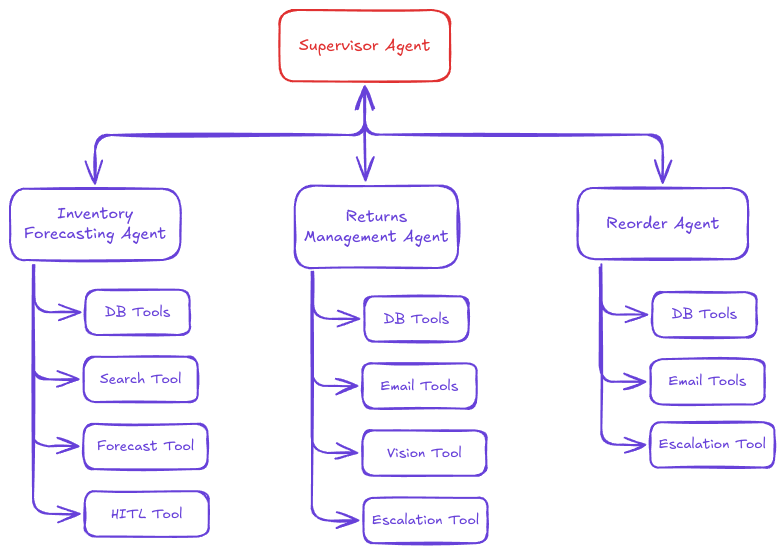
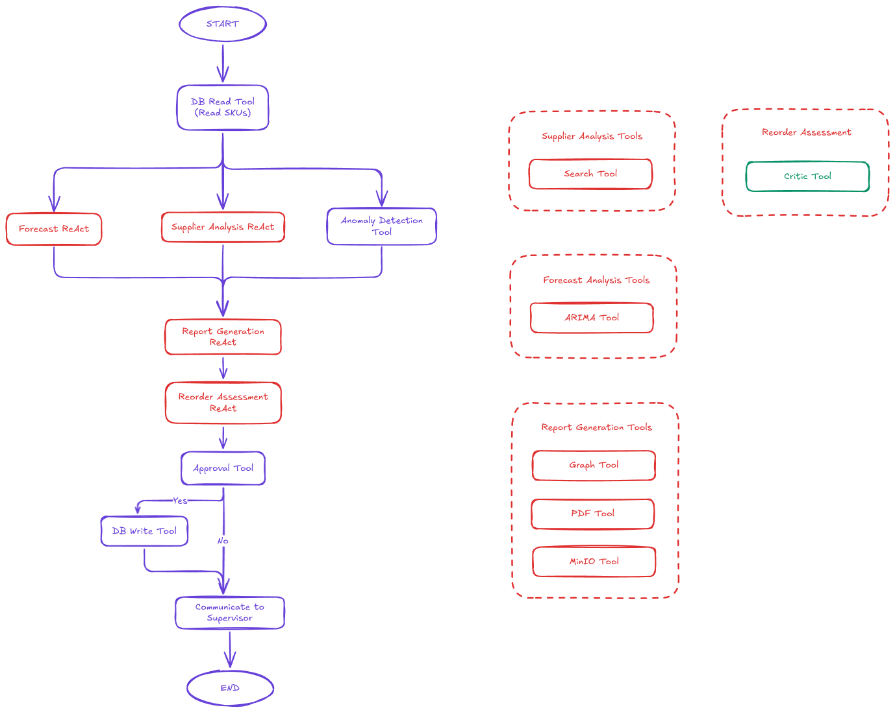
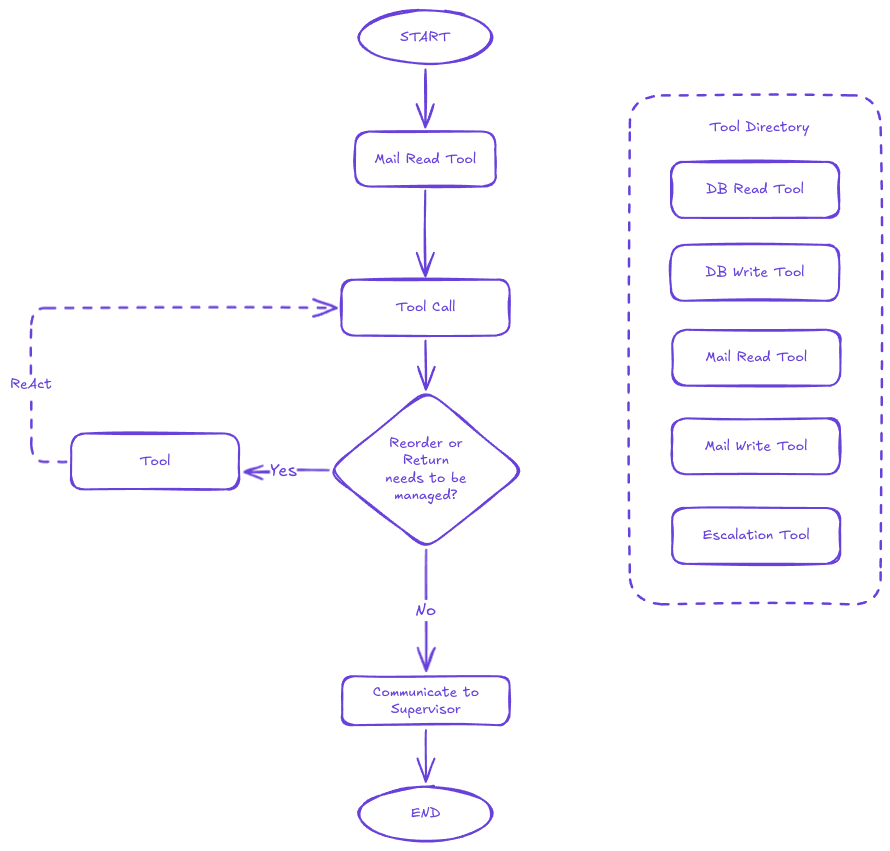
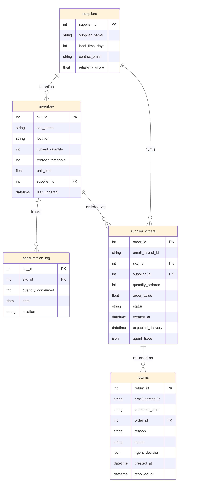

# Problem and Solution Proposed

Supply Chain process is complex and difficult to be monitored. For each order and return, several level of complexity needs to be handled. This can be made faster, automated and easier with Agent based solution. SMind tackles 3 major parts in a supply chain:

1. **Inventory Optimisations**: Demands spike or drop and the SKUs (resources) required can increases. This needs to delegated intelligently by righteous reasoning and forecasting on a 30 window. Reordering is done based on the forecasting and reordering assessment
   
2. **Reordering Supplies**: Reordering is not seen as a single form fill or email process. Each time order is sent; the order needs to be monitored and assess. Reaching back when the order is not received, handling any dispensaries in quantity, ETA or cost, etc. are few case scenarios.
   
3. **Return Management**: Return Management is one of the most chaotic part of the supply chain. Often this happens due to assessing the return material and if the return is truly genuine. A return can be as simple as using the item as refurbished to something as complex as send the return to a supplier. 

# Technical Design

The solution is to build a Deep Agent **Supervisor-Worker** Architecture design and tackle these issue. Each part is handled by an agent and a supervisor agent delegates the tasks to these agents. Supervisor agent is triggered by supplier mail, return mails from customers and by a scheduler which is required for inventory optimisation. 

## Agent Design

**Agents**:
1. Inventory Forecasting Agent

2. Reordering and Return Management Agent

## Architecture

**Tech Stack**
1. LangGraph - Agent Framework
2. Docker Compose - Monolithic Deployment to maintain Cloud agnostic design
3. AgentOps - Monitoring
4. Postgres - Database 
5. MinIO - Local file handling (for saving reports)
6. LiteLM - Uniform LLM interaction to maintain LLM agnostic design
7. AutoGen - Required for agent critic
8. Temporal - Required to hold high level HITL, Supplier and Customer interaction with state management.
9. React - UI for monitoring and HITL interactions

**Key Design Principals**
1. HITL is must included in below stages:
   - Before execution of reordering post forecasting (Critical step; requires approval)
   - Escalation of issues and negotiations of reordering or return conversations (Complex task and accountable; requires to hand-off tasks to humans) 
2. Traceability: Every step taken by agent is observed and traced back via AgentOps
3. Retry and Failure handling: Internally implemented within LangGraph but mostly handled by Temporal at higher level for agent replay or re-execution. 
4. Cloud and LLM agnostic: This is done in order for easy migrations
5. Monolithic Deployment: Currently for easy development and deployment; but required to be changed to micro-services based on requirements and further assessment.
6. Intensive Guardrail development: Required for strict enforcement as tasks are critical. 

## Database Design
